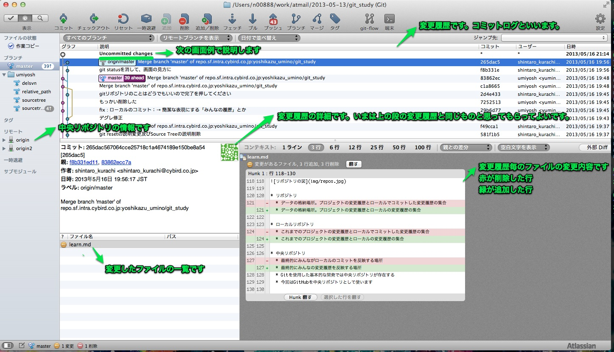
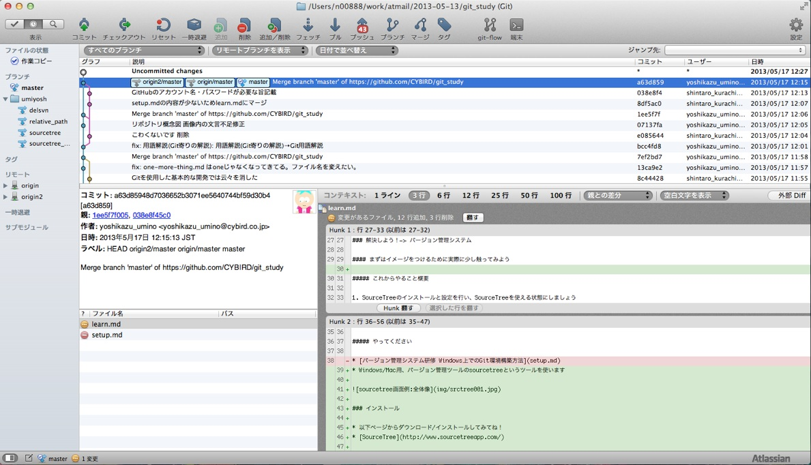
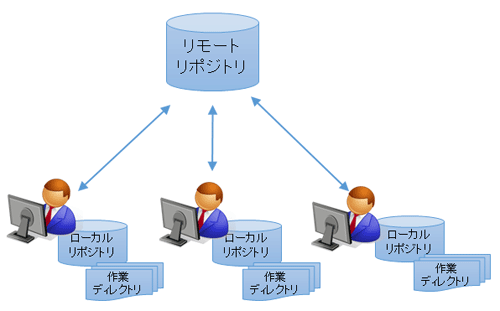
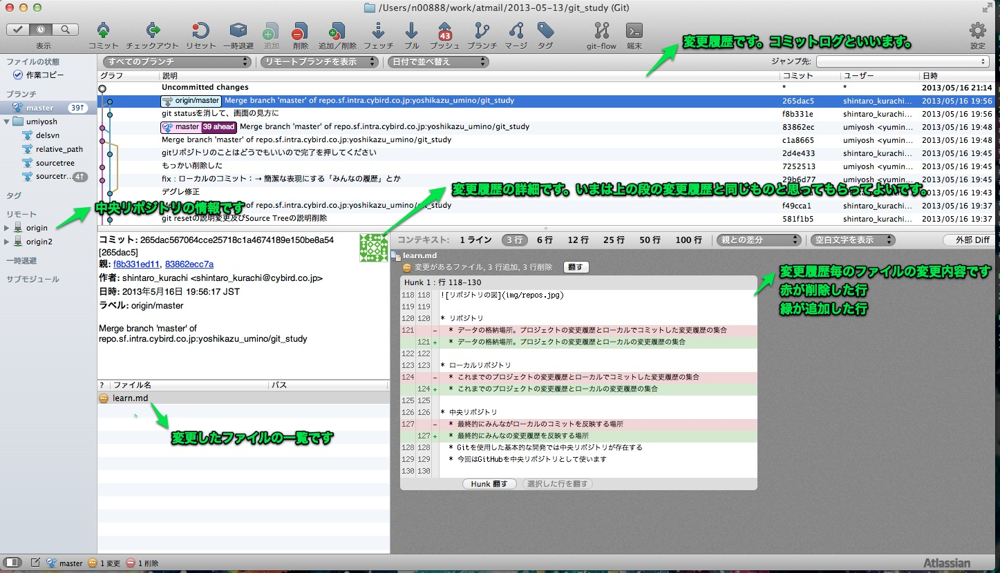
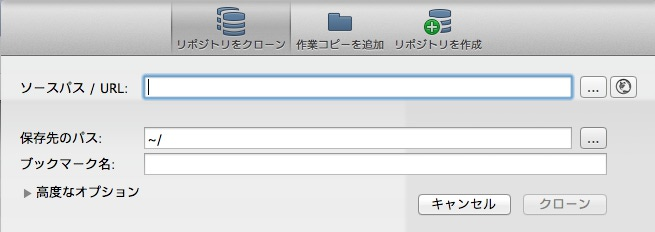
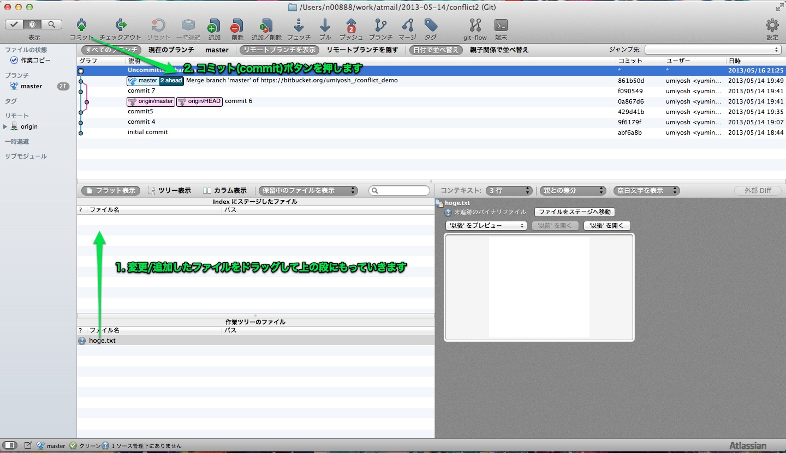
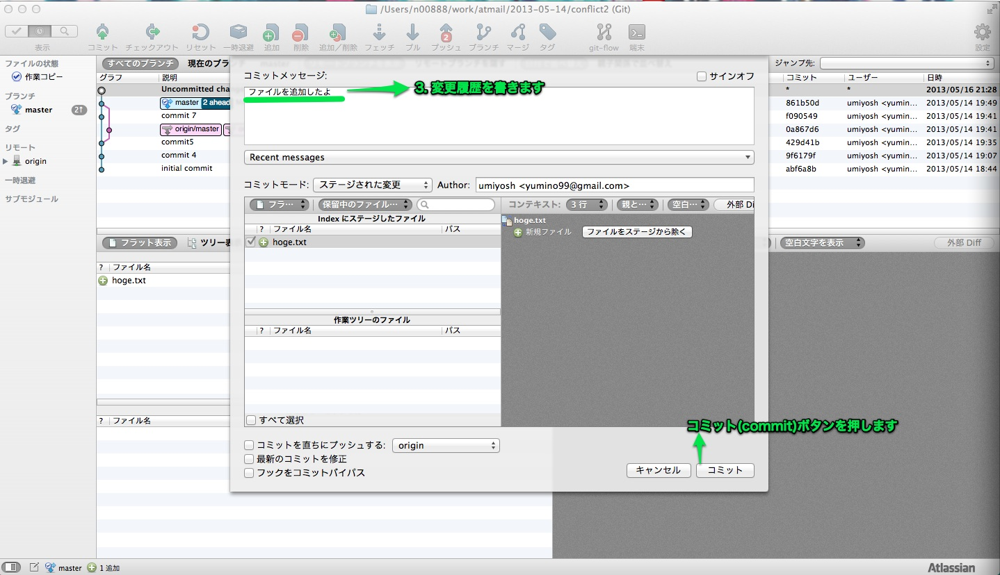
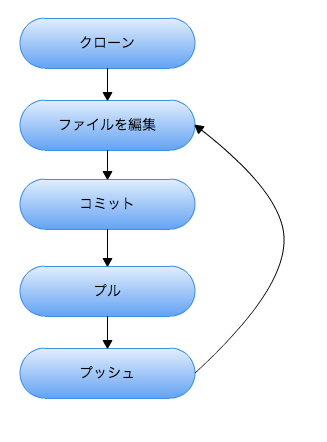

バージョン管理システム
===

## 最初に

ツールのインストールに時間がかかるため、最初に実施しておきます。

### 本日使うツールのインストール

* Windows/Mac用、バージョン管理ツールのSourceTreeというツールを使います

* 以下ページからダウンロード/インストールしてみてね！
* [SourceTree](http://www.sourcetreeapp.com/)

## バージョン管理システム

### この講義の目的

* 目的1：バージョン管理の用途/メリット/構成を学ぶ
* 目的2：制作現場の共同作業に必要な最低限のバージョン管理の使い方を学ぶ

### バージョン管理システムって？

* ファイルの変更履歴を管理するツールです
* 変更履歴からファイルを復元することができます
* 多人数で同じプロジェクトのファイルに作業するときに起こる矛盾などをなくすことができます

### 複数人もしくは一人でのファイル編集で困ること

* JavaScriptを書いていて動かなくしてしまったので動いていたあの時に戻したい
* 皆が個々の好きな場所でファイルを作成しており、かき集めるのが大変…
* それぞれのファイルの最新の状態がわからない！このファイルの最新バージョンは誰が持っているのかな…
* 他の人の編集したファイルを見るのが面倒(いちいち共有フォルダにおいてその場所を教えてあげなくちゃいけない！？！？)
* 皆のファイルを同じところで管理させようと共有ファイル上で開発させたらいつの間にか同じファイルを複数人で編集して上書きが発生。誰かの編集したものが消滅したっぽいがなにが消滅したのかよくわからない…
* ファイルを更新する際のバックアップのためにindex.html.20120611_1, index.html.20120611_2とか日付をつけてやってたけどファイルが増えすぎて鬱陶しいしindex.html.最新 とかindex.html.こっちこそ本物 とかどのファイルがどの変更の際のものかがわからない…
* この部分のプログラムがなんのために書かれているかわからない…
* この部分のプログラムは腐れ過ぎている誰が書いたんですか死んでくださいというかなんのためのプログラムかもわからないので質問したいです本当に誰が書いたんですか…

### 解決しよう！-> バージョン管理システム

#### まずはイメージをつけるために実際に少し触ってみよう

##### これからやること概要

1. バージョン管理用ツールをインストールし、バージョン管理ツールを使用してGitHubからファイルをダウンロードできることを確認します
1. 講師がバージョン管理ツールを使用してファイルの変更を行い、その変更が皆さんの手元に反映されることを確認します
1. 皆さんが手元でファイル変更を行い、それをGitHubにアップロードし、他の人の変更が皆さんの手元に反映されることを確認します

##### セットアップ

1. 最初に起動すると多分こんな画面
  * 一番上をクリックしてNextボタンをクリックしましょう
  
1. 次に多分こんな画面
  * ユーザ名、メールアドレスを入力しましょう(ここで登録した名前でコミットした人が記録されます。Githubアカウントのユーザ名・メールアドレスと同じものを入れてください)
  
1. 次に多分こんな画面
  * バージョン管理を行うために必要なファイルを作成してもいいかを聞かれています。Yesをクリックしてください。
  
1. 次に多分こんな画面
  * 認証方式を聞かれていますが、今回の研修には関係ないです。そのままNextをクリックしてください。
  
1. これでSourceTreeが動くようになりました

##### さわってみよう

1. GitHubからファイルをダウンロードしよう
  * 以下の○がついたところをクリック
  
  * 今回の講習用の中央リポジトリURLを追加してcloneしてください
  * もし一度cloneに失敗して再度cloneしたい場合はcloneしたディレクトリを削除しましょう
  
    * URL:      <code>https://github.com/cy-ken-goto/git_test.git</code>
    * フォルダはURLを入力後、入力欄をクリックすると自動入力されます

1. 他人の変更したファイルをダウンロードしよう
  * 講師がファイルをアップロードするのでこのファイルをダウンロードしてください
  * 画面のプルボタンを押します
  
  * 左側にある"master"の部分をクリックすると変更内容が見られますよ
  
  * 変更内容画面
    

### 何が便利なのか

1. ファイルを一元管理可能(みんなで共用するバージョン管理サーバを設けることができます)
  * ファイルが散らばらない(かき集めるのが大変ではない)
  * 最新のファイルが簡単に手に入る
  * 簡単なバックアップになる
2. ファイルの変更履歴を管理
  * このコードは誰がなんのために変更したのかという履歴を保持
  * 決まった時点へのファイルの巻き戻しが可能
  * 日付付きバックアップを作成する必要などなく、気分がよい←人生において"精神衛生上よい"ことは非常に大切!!根性で解決しようとするな!
3. 同時に同じファイルを編集することが可能
  * 同じファイルを同時に編集しても編集内容が消えたりしない
  * 同時に複数人が編集したファイルの編集内容を可能な範囲で自動的に併合(マージ)してくれる

### エンジニアだけの道具ではない

* エンジニアしかバージョン管理システムを使わない場合
  * A「HTML,CSS,イメージファイル作りましたーー」B「わかったー。じゃあ頂戴ーー。」A「わかりましたーー。サイズ大きいのでZIPで圧縮してからメール添付しますーー」
    1. A:必要なファイルをかき集めてZIP圧縮
    1. A:メール作成/送信
    1. B:メール読む
    1. B:解凍
    1. B:変更点を頑張って確認
    1. B:自分で共有フォルダに反映
    1. → めんどくさい＞＜ ミスが起こりやすい＞＜
    1. → デグレ(IT俗語:前の人の変更点を消してしまうこと)った！＞＜
* エンジニアではないAさんもバージョン管理システムを使える場合
  * A「HTML,CSS,イメージファイル作りましたーー。GitHubにあげたので取り込んでおいてくださいねー。」B「わかったーー」
    1. A:アップロードする
    1. B:アップロードされたものを取得
    1. SourceTreeで簡単に変更点確認 -> Very 簡単！！！デグレとかがない！！！

* 実際に、弊社でもデザイナさんは画像の管理にバージョン管理システムを使用していますし、プランナーさんは仕様書の管理にバージョン管理システムを使用してエンジニアと一緒に仕事している事例が増えてきてます
* このページ自体も全てGitHubでバージョン管理して2人で作業しました。
  * 超楽でした。複数人での作業に非常に強力な味方になってくれますね。

  

## 今回扱うバージョン管理ツール

* Gitとは
  * 一番使われているバージョン管理システムです
    * 他にもSVNとかあるけど、使うときになったら覚えましょう（使う機会は今後は減ってくとおもいますが）
  * 手元のPCでファイルの履歴を管理しリモートリポジトリを介してそれをやり取りします
  * 最近のエンジニアはもっぱらGitで開発している
  * 今回はGitを簡単に使えるSourceTreeを使って講習を行います

## Gitの基本的な構成

* リポジトリ
  * データの格納場所。プロジェクトの変更履歴とローカルの変更履歴の集合

* ローカルリポジトリ
  * これまでのプロジェクトの変更履歴とローカルの変更履歴の集合

* 中央リポジトリ
  * 最終的にみんなの変更履歴を反映する場所
  * 今回はGitHubを中央リポジトリとして使います

## Git用語解説 及びSourceTreeの主な操作方法

* SourceTree画面の見方
  * 常に現在の状態が表示されています。変更履歴も表示されます。

* クローン(clone)
  * 中央リポジトリからプロジェクトの変更履歴とファイルを取得する
  * SourceTreeでは以下のように使用します

* コミット(commit)
  * ファイルの変更のスナップショットをとること。プロジェクトの変更履歴にしおりを挟むイメージ。コミット時のファイルの中身や変更点は後ほど見ることが可能
  * 日常会話で「コミットする」というと、「約束する」みたいなイメージかと思いますが、バージョン管理の「コミット」は「変更を確定する」みたいなイメージですかね。
  * 編集意図を書き残すためのものでもある
  * ローカルリポジトリは気軽にコミットしてよいです
  * そのコミットを中央リポジトリに反映する際は、その編集が全員に影響しうることを認識し、「動かないコードなど意図しないファイルを中央リポジトリに反映させた」が起こらないように気をつけること
  * SourceTreeでは以下のように使用します

* プル(pull)
  * 他の人の中央リポジトリへの変更を自分のワークツリーに反映する
  * 他の人がpushした変更点を手元に反映することができます
  * 自分がpushするまえに他人の変更をpullしましょう
    * この順序ならリモートとの変更履歴と常に一致するのでエラーがおこることが少ないです
    * 人が判断しないと併合できない変更があるので手元でマージをするのです( 同じファイル同じ行が変更された場合など )
  * SourceTreeでは以下のように使用します

* プッシュ(push)
  * 手元の変更履歴を中央リポジトリに反映すること
  * 他の人がpush済みの変更を手元にpullしていない場合、エラーが出ますがその場合は慌てず騒がずpullした後に再度pushしましょう
  * SourceTreeでは以下のように使用します

* コミットの取り消し
  * コミットは取り消すことができます
  * 最初の頃は、一度したコミットを取り消ししようなどとは考えず、取り消したい変更を修正し新たにコミットをしたほうがいいのです(初期は使わないほうがいいと思うし説明はしません)
  * なにがまずいかというと、中央リポジトリにプッシュしたあとに、不用意に取り消しを行うとプルしてもプッシュできない状態になったりします。→ 詰んだ状態
  * 非エンジニアの人は、このような状態になったらエンジニアの人に助けてもらいましょう
  * エンジニアの人は、このような状態になっても詰まないように解決方法を覚えておく必要があります。そのためにも後半で説明する<code>Learn More</code>に発展課題を記載したので実践してみましょう

* 今日はこの流れだけ覚えて帰りましょう

## 余談：そもそもこのテキストが載っているGithubとは

* 中央リポジトリを作成してくれるサイト
* オープンソースの開発も結構この上で行われている
* ソースコードの変更履歴などがWeb上で閲覧可能 例:https://github.com/dekokun/TDD/commits/master/test.js
* サイバードの一部プロジェクトもGitHubのプライベートリポジトリ(有料)を使ってます

## ハンズオン

* [ハンズオン](handson.md)

## 質問受付

